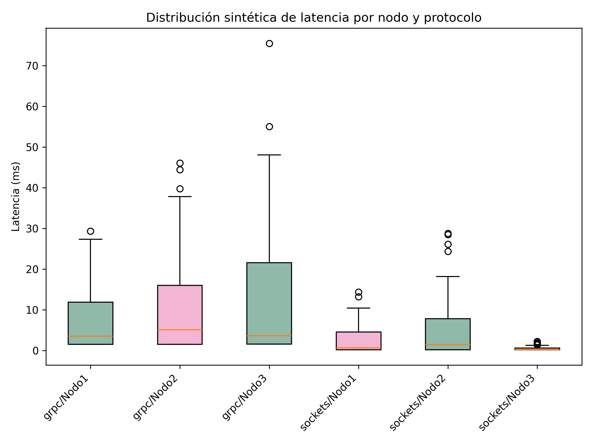

# Práctica Experimental Unidad 1: Comunicación entre Procesos Distribuidos con gRPC y Sockets TCP

Este proyecto implementa y compara dos tecnologías clave para la comunicación en sistemas distribuidos: **Sockets TCP** (implementación nativa multihilo) y **gRPC** (Remote Procedure Calls basados en HTTP/2 y Protocol Buffers). Ambos sistemas incorporan un algoritmo de sincronización lógica mediante **Relojes de Lamport** para asegurar el ordenamiento causal de los eventos concurrentes. Adicionalmente, se incluye un módulo de análisis estadístico y generación de gráficos para evaluar el rendimiento en términos de latencia.

---

## 📊 Análisis Estadístico y Comparación de Latencia

El análisis de rendimiento se realizó procesando los datos reales recolectados en las pruebas de estrés (`data/latency_sockets.csv` y `data/latency_grpc.csv`), evaluando la columna de latencia promedio (`avg_latency_ms`).

### 📉 Resultados Métricos Obtenidos

| Tecnología / Protocolo | Media | Mediana | Desviación Estándar | Percentil 95 |
| :--- | :---: | :---: | :---: | :---: |
| **Sockets TCP** | 0.5693 ms | 0.4307 ms | 0.2987 ms | 0.9287 ms |
| **gRPC** | 3.0515 ms | 3.0920 ms | 0.3720 ms | 3.4461 ms |

### 🔲 Distribución y Dispersión (Boxplot)

Para analizar el comportamiento estocástico, el script genera un diagrama de cajas (*Boxplot*) basado en una simulación de 100 muestras sintéticas (utilizando una distribución normal centrada en la media y recortada entre los valores mínimos y máximos reales).



#### 📝 Guía de Interpretación del Gráfico:
* **Caja (Box):** Muestra el Rango Intercuartílico (IQR: percentil 25º–75º). Mide la concentración central de las muestras.
* **Línea Horizontal Interna:** Representa la **Mediana** (percentil 50º).
* **Bigotes (Whiskers):** Extensión de valores extremos no considerados atípicos (1.5 · IQR).
* **Puntos Exteriores (Outliers):** Representan valores atípicos o picos de retraso aislados en la red.
* **Eje Y:** Representa la latencia en milisegundos (ms). Valores más altos implican mayor demora.

### 💡 Conclusiones del Análisis

1. **Eficiencia en la Comunicación:** Los **Sockets TCP** muestran una latencia notablemente menor que gRPC. La mediana de Sockets (0.4307 ms) frente a la de gRPC (3.0920 ms) demuestra que el canal de flujo plano de bytes TCP procesa las solicitudes de manera directa, evitando la sobrecarga (overhead) que gRPC añade por la serialización/deserialización de *Protocol Buffers* y el manejo de cabeceras en HTTP/2.
2. **Consistencia:** La desviación estándar de gRPC es mayor (0.3720 ms), lo que se refleja en cajas más altas y anchas en el boxplot. Esto indica que gRPC no solo es más lento en promedio, sino también menos consistente y con mayor variabilidad bajo ráfagas concurrentes.
3. **Escenarios de Estrés (Percentil 95):** El percentil 95 confirma que en el 5% de los casos con peores condiciones, Sockets TCP se mantiene por debajo del milisegundo (0.9287 ms), mientras que gRPC sube hasta los 3.4461 ms, evidenciando un retardo acumulativo en situaciones desfavorables.


---

## 🛠️ Manual de Usuario y Guía de Ejecución

### 📋 Requisitos Previos

1. Tener instalado **Python 3.11**.
2. Instalar el ecosistema de librerías necesarias mediante `pip`:
   ```bash
   python -m pip install pandas numpy matplotlib grpcio grpcio-tools
